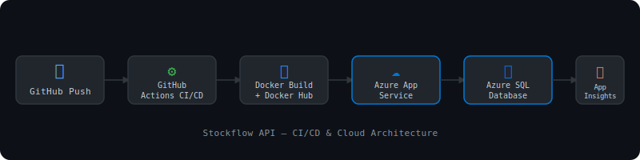

# StockFlow API 🚀

A cloud-native inventory management system with enterprise-grade Azure security, automated CI/CD and scalable Kubernetes infrastructure.

## 🟢 Live Demo

**Swagger UI:** <https://stockflow-api-prod.azurewebsites.net/swagger>

> Authenticate using your Microsoft account to access the protected endpoints.

## 💻 Tech Stack

|Layer           |Technology                          |
|----------------|------------------------------------|
|API             |ASP.NET Core 8                      |
|Auth            |Azure AD OAuth2 (Microsoft Identity)|
|Database        |SQL Server on Azure                 |
|ORM             |Entity Framework Core               |
|Containerization|Docker                              |
|Registry        |Docker Hub                          |
|CI/CD           |GitHub Actions                      |
|Hosting         |Azure App Service                   |
|Logging         |Serilog                             |
|Monitoring      |Azure Application Insights          |
|Documentation   |Swagger / OpenAPI                   |

## 🏗️ Architecture



```
GitHub Push

↓
GitHub Actions CI/CD

↓
Docker Build & Push → Docker Hub

↓
Azure App Service (Docker Container)

↓
Azure SQL Database
```

## 🌐 API Endpoints

|Method|Endpoint          |Description      |Auth      |
|------|------------------|-----------------|----------|
|GET   |/health           |Health check     |Public    |
|GET   |/api/Products     |Get all products |🔒 Required|
|POST  |/api/Products     |Create product   |🔒 Required|
|GET   |/api/Products/{id}|Get product by ID|🔒 Required|
|PUT   |/api/Products/{id}|Update product   |🔒 Required|
|DELETE|/api/Products/{id}|Delete product   |🔒 Required|

## ✅ Features

- Full CRUD REST API
- Azure AD OAuth2 authentication
- JWT Bearer token authorization
- Entity Framework Core migrations
- Global exception handling middleware
- Health checks endpoint
- Serilog structured logging
- Swagger UI with OAuth2 support
- Dockerized for consistent deployments
- Automated CI/CD pipeline – push to main deploys to Azure

## 🚀 CI/CD Pipeline

Every push to `main` automatically:

1. Restores and builds the .NET project
1. Builds a Docker image
1. Pushes to Docker Hub
1. Deploys to Azure App Service

## 🖥️ Local Development

### Prerequisites

- .NET 8 SDK
- Docker Desktop
- SQL Server or Docker

### Run locally

```bash
git clone https://github.com/usmanb21/Stockflow-API.git
cd Stockflow-API
dotnet restore
dotnet run
```

### Run with Docker

```bash
docker-compose up
```

## 🏗️ Technical Decisions

|Decision        |Choice               |Why                                             |
|----------------|---------------------|------------------------------------------------|
|Auth            |Azure AD OAuth2      |Enterprise standard; avoids managing credentials|
|Database        |SQL Server on Azure  |ACID compliance for inventory data integrity    |
|ORM             |Entity Framework Core|Type-safe migrations, avoids raw SQL errors     |
|Logging         |Serilog              |Structured logs compatible with Azure Monitor   |
|Containerization|Docker               |Consistent environments across dev and prod     |
|CI/CD           |GitHub Actions       |Native GitHub integration, no extra tooling     |
|DB in K8s       |Pod (demo only)      |Production should use Azure SQL Managed Instance|

## 👤 Author

**@uUsman**
[LinkedIn](https://www.linkedin.com/in/usman-zahid-butt-353a9430)